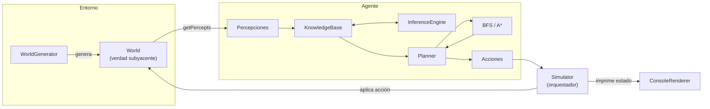
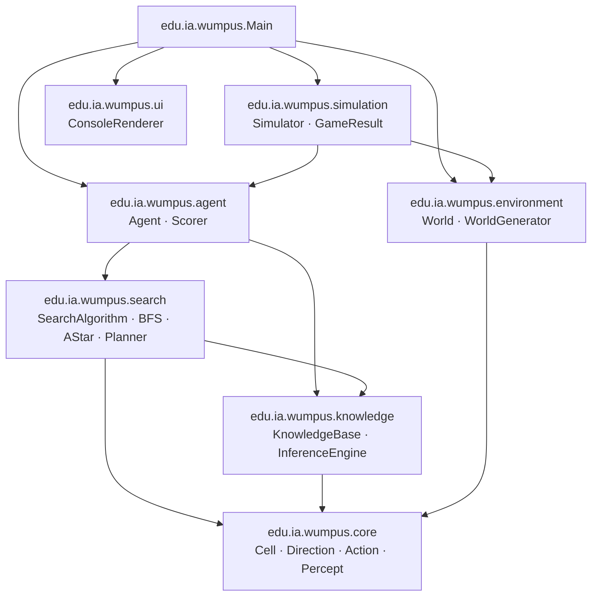
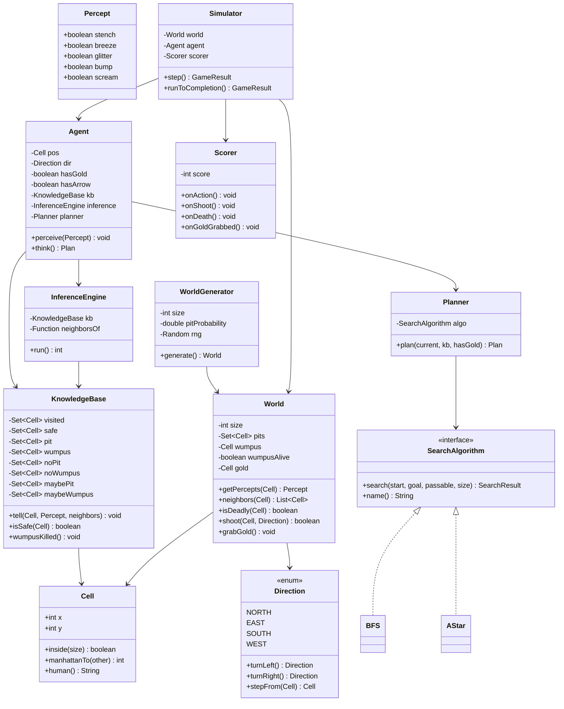
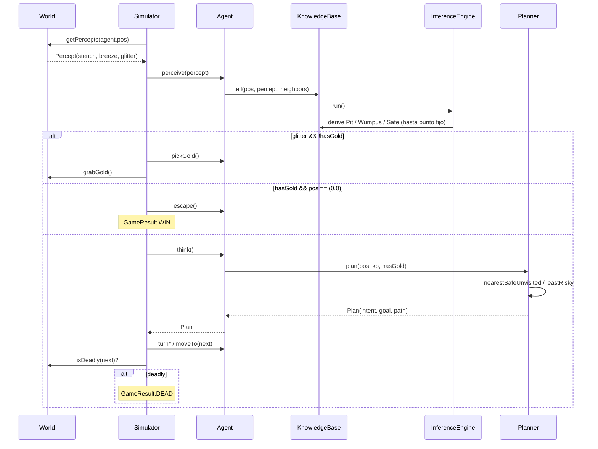
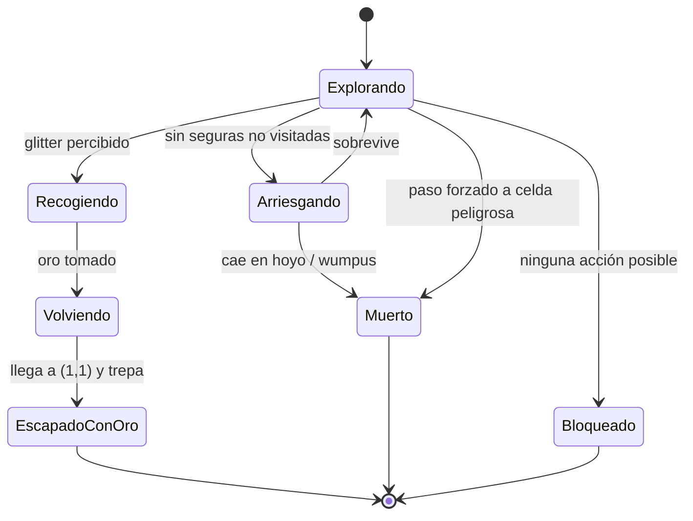
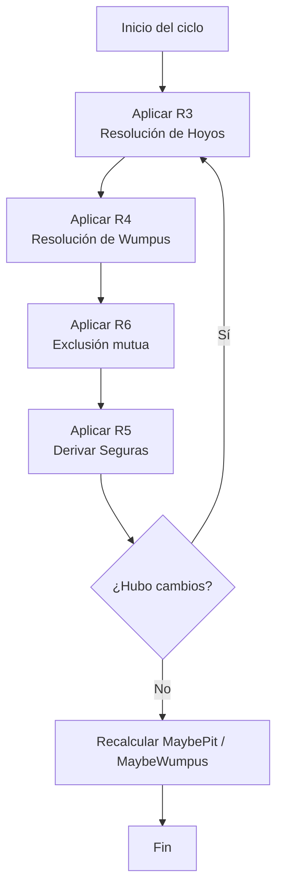
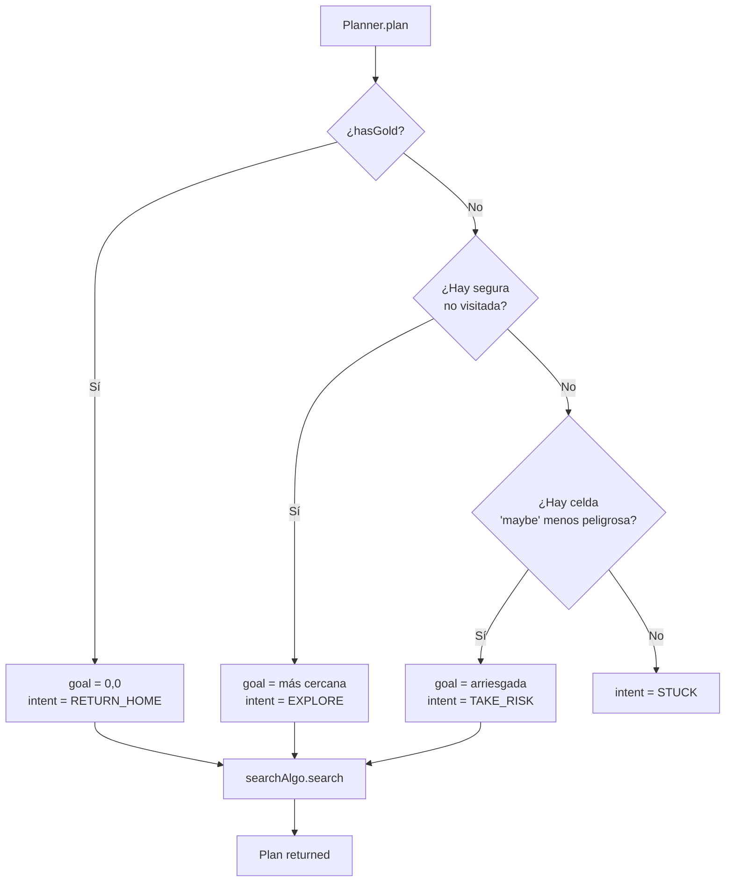

# Wumpus World — Agente Lógico (Java 17)

> Proyecto final de Inteligencia Artificial · 2026-I
> Agente racional que explora el Mundo de Wumpus mediante **inferencia proposicional** y **algoritmos de búsqueda** (BFS / A\*).

---

## Índice

1. [Visión general](#1-visión-general)
2. [Cómo compilar y ejecutar](#2-cómo-compilar-y-ejecutar)
3. [Arquitectura del proyecto](#3-arquitectura-del-proyecto)
4. [Diagrama de paquetes](#4-diagrama-de-paquetes)
5. [Diagrama de clases](#5-diagrama-de-clases)
6. [Ciclo de vida de un turno](#6-ciclo-de-vida-de-un-turno)
7. [Motor de inferencia — reglas y ejemplo](#7-motor-de-inferencia--reglas-y-ejemplo)
8. [Algoritmos de búsqueda](#8-algoritmos-de-búsqueda)
9. [Reparto de responsabilidades por clase](#9-reparto-de-responsabilidades-por-clase)
10. [Tests](#10-tests)
11. [Decisiones de diseño](#11-decisiones-de-diseño)

---

## 1. Visión general

El **Mundo de Wumpus** (AIMA, cap. 7) es un entorno parcialmente observable, determinista, secuencial, estático y discreto. El agente:

| Sensor          | Significado                                                  |
|-----------------|--------------------------------------------------------------|
| **Hedor**       | Hay un Wumpus en una casilla adyacente (N/E/S/O).            |
| **Brisa**       | Hay un hoyo en una casilla adyacente.                        |
| **Resplandor**  | El oro está en la casilla actual.                            |
| **Golpe** (Bump)| Se chocó contra una pared al avanzar.                        |
| **Grito**       | El Wumpus acaba de morir (eco de un disparo).                |

| Acción          | Coste              |
|-----------------|--------------------|
| Avanzar, girar, agarrar, trepar | −1 cada una         |
| Disparar la única flecha        | −10 adicional       |
| Morir (hoyo o Wumpus)           | −1000               |
| Recoger el oro                  | +1000               |

**Objetivo:** salir de (1,1) con el oro maximizando el puntaje sin morir.

---

## 2. Cómo compilar y ejecutar

### Requisitos

* JDK 17+
* Maven 3.8+

### Compilación

```bash
cd wumpus-java
mvn clean package          # compila + corre tests + empaqueta el jar
```

### Ejecución (consola)

```bash
mvn exec:java                                       # 6x6, A*, semilla aleatoria
mvn exec:java -Dexec.args="8 bfs 42"                 # 8x8, BFS, semilla 42
mvn exec:java -Dexec.args="4 astar 123 reveal"       # imprime también la verdad subyacente
# o bien, con el jar:
java -jar target/wumpus-world-1.0.0.jar 6 astar 7
```

### Ejecución (interfaz gráfica Swing)

La GUI muestra el tablero dibujado, los paneles de Base de Conocimiento e
Inferencias en vivo, y controles (tamaño, BFS/A\*, velocidad, Paso/Auto).

```bash
mvn -q compile exec:java -Dexec.mainClass=edu.ia.wumpus.SwingMain
```

**En IntelliJ IDEA (recomendado):** abre
`src/main/java/edu/ia/wumpus/SwingMain.java` y pulsa el ▶ verde junto a
`main()`. Se abrirá la ventana de la aplicación.

#### Modo Manual vs Automático

El selector **Modo** de la barra superior cambia quién controla al agente:

* **Manual** (por defecto) — **tú** decides. Las casillas vecinas a las que
  el agente puede moverse aparecen resaltadas con un borde punteado azul; haz
  **clic** en una de ellas y el sistema ejecuta exactamente el mismo proceso
  que el modo automático: gira + avanza (puntuando cada acción), comprueba si
  la casilla es mortal, **percibe** la nueva celda, corre la **inferencia**
  sobre la KB y recoge el oro si hay resplandor. Cuando lleves el oro y estés
  de vuelta en (1,1), pulsa **«Salir ⬆»** para trepar y ganar.
* **Automático** — el agente decide solo con BFS/A\* (botones **Paso** y
  **Auto**), como en la demo original.

> En modo manual puedes tomar riesgos: si haces clic en una casilla con un
> hoyo o el Wumpus, el agente muere (−1000) — igual que en el juego real. El
> panel de **Inferencias en vivo** te muestra por qué una casilla era o no
> segura tras cada movimiento.

### Tests

```bash
mvn test                   # ejecuta toda la batería JUnit 5
```

---

## 3. Arquitectura del proyecto

El sistema sigue el patrón canónico de **agente racional basado en modelo**:
percibe el entorno, mantiene un estado interno (la KB), razona sobre él e
intenta maximizar su función de utilidad. La separación entre lo que el
agente **sabe** y lo que **es verdad** es estricta: la KB nunca consulta al
`World` directamente, y el `World` jamás “escucha” al agente.



---

## 4. Diagrama de paquetes



> **Regla de dependencias:** el grafo es acíclico. `core` no depende de nadie.
> `knowledge` y `search` se mantienen aislados — son piezas reutilizables.

---

## 5. Diagrama de clases



---

## 6. Ciclo de vida de un turno

Cada turno el `Simulator` ejecuta exactamente la siguiente secuencia. Los
componentes están desacoplados: el agente nunca toca el mundo, el mundo
nunca toca la KB.



### Diagrama de estado del agente



---

## 7. Motor de inferencia — reglas y ejemplo

El `InferenceEngine` aplica **encadenamiento hacia adelante** (forward chaining)
sobre el siguiente conjunto de reglas hasta alcanzar un punto fijo:

| ID | Regla                                                              | Donde se aplica          |
|----|--------------------------------------------------------------------|--------------------------|
| R1 | `¬Brisa(x,y) ⇒ ∀ v∈vec(x,y): ¬Hoyo(v)`                              | KB.tell (directa)        |
| R2 | `¬Hedor(x,y) ⇒ ∀ v∈vec(x,y): ¬Wumpus(v)`                            | KB.tell (directa)        |
| R3 | `Brisa(x,y) ∧ #{v∈vec(x,y): no probado ¬Hoyo}=1 ⇒ Hoyo(c)`         | InferenceEngine (R3)     |
| R4 | `Hedor(x,y) ∧ #{v∈vec(x,y): no probado ¬Wumpus}=1 ⇒ Wumpus(c)`     | InferenceEngine (R4)     |
| R5 | `¬Hoyo(c) ∧ ¬Wumpus(c) ⇒ Seguro(c)`                                 | InferenceEngine (R5)     |
| R6 | `Hoyo(c) ⇒ ¬Wumpus(c)` y `Wumpus(c) ⇒ ¬Hoyo(c)`                     | InferenceEngine (R6)     |

### Diagrama de flujo del motor



### Ejemplo paso a paso

Supongamos un tablero 4×4. El agente arranca en (1,1), no percibe nada;
camina a (2,1) y percibe **brisa**; vuelve y va a (1,2), tampoco percibe nada.

| Turno | Acción           | Hecho aprendido                                                          |
|-------|------------------|--------------------------------------------------------------------------|
| 1     | percibe (1,1)    | `¬B ∧ ¬H ⇒ Seguro(2,1), Seguro(1,2)`                                     |
| 2     | percibe (2,1)    | `B(2,1) ⇒ Hoyo(3,1) ∨ Hoyo(2,2)`                                         |
| 3     | percibe (1,2)    | `¬B(1,2) ⇒ ¬Hoyo(2,2)`                                                   |
| 3 ↓   | inferencia R3    | `Hoyo(3,1) ∨ Hoyo(2,2) ∧ ¬Hoyo(2,2) ⊢ **Hoyo(3,1)**`                     |
| 3 ↓   | inferencia R5    | `¬Hoyo(2,2) ∧ ¬Wumpus(2,2) ⊢ **Seguro(2,2)**`                            |

El agente nunca pisa (3,1) y puede explorar (2,2) con seguridad. Estos
escenarios se encuentran replicados como tests JUnit en
`InferenceEngineTest.java`.

---

## 8. Algoritmos de búsqueda

Ambos algoritmos operan sobre el **sub-grafo de celdas seguras** que el
agente cree conocer (un `Predicate<Cell> passable`). Esto es clave: el
planificador nunca propone una ruta que pase por una casilla peligrosa.

### Comparativa

| Aspecto                     | BFS                                | A\*                                  |
|-----------------------------|------------------------------------|--------------------------------------|
| Tipo                        | No informada                       | Informada                            |
| Óptimo                      | Sí (costos uniformes)              | Sí (heurística admisible)            |
| Heurística                  | —                                  | Manhattan \|Δx\|+\|Δy\|              |
| Estructura                  | Cola FIFO (`ArrayDeque`)           | Cola de prioridad (`PriorityQueue`)  |
| Nodos expandidos (típico)   | Mayor — explora por capas          | Menor — dirige hacia el objetivo     |
| Complejidad tiempo          | `O(b^d)`                            | `O(b^d)` peor caso, mucho menor real |
| Uso en el proyecto          | Exploración (siguiente segura)     | Retorno óptimo a (1,1) tras el oro  |

### Diagrama del Planner



---

## 9. Reparto de responsabilidades por clase

| Paquete             | Clase              | Responsabilidad única                                                  |
|---------------------|--------------------|-----------------------------------------------------------------------|
| `core`              | `Cell`             | Coordenada 2D inmutable (record).                                     |
| `core`              | `Direction`        | 4 orientaciones + giros + avance unitario.                            |
| `core`              | `Action`           | Catálogo de acciones del agente.                                       |
| `core`              | `Percept`          | Vector inmutable de sensores.                                          |
| `environment`       | `World`            | Estado real del mundo + percepciones.                                  |
| `environment`       | `WorldGenerator`   | Generación pseudoaleatoria reproducible.                               |
| `knowledge`         | `KnowledgeBase`    | Hechos creídos por el agente (`Set<Cell>` indexados por átomo).        |
| `knowledge`         | `InferenceEngine`  | Forward chaining R1–R6 hasta punto fijo.                              |
| `search`            | `SearchAlgorithm`  | Interfaz Strategy.                                                    |
| `search`            | `BFS`, `AStar`     | Implementaciones intercambiables.                                      |
| `search`            | `Planner`          | Decide qué buscar y delega en el algoritmo.                            |
| `agent`             | `Agent`            | Estado físico del agente + orquesta percibir/inferir/planear.          |
| `agent`             | `Scorer`           | Acumulador de puntaje con la fórmula AIMA.                             |
| `simulation`        | `Simulator`        | Loop de turnos, materializa las acciones sobre el mundo.               |
| `simulation`        | `GameResult`       | Enum del resultado terminal.                                           |
| `ui`                | `ConsoleRenderer`  | Pintar tableros ASCII (vista del agente + modo dios).                 |
| `ui.swing`          | `WumpusFrame`      | Ventana principal: controles + tablero + paneles laterales.           |
| `ui.swing`          | `BoardPanel`       | Dibuja el tablero (celdas, percepciones, ruta, agente).               |
| `ui.swing`          | `Theme`            | Paleta y fuentes compartidas de la GUI.                               |
| (raíz)              | `Main`             | Punto de entrada de CONSOLA.                                          |
| (raíz)              | `SwingMain`        | Punto de entrada de la INTERFAZ GRÁFICA.                              |

---

## 10. Tests

JUnit 5. Cobertura por módulo:

| Test                              | Qué verifica                                                  |
|-----------------------------------|---------------------------------------------------------------|
| `CellTest`                        | Igualdad por valor, Manhattan, in-bounds.                     |
| `DirectionTest`                   | Giros 90° y avance unitario.                                  |
| `WorldTest`                       | Percepciones, vecindarios, letalidad, disparo.                |
| `WorldGeneratorTest`              | Determinismo por semilla, casillas seguras de inicio.         |
| `KnowledgeBaseTest`               | `tell` directo y propagación de ¬Hoyo/¬Wumpus.                |
| `InferenceEngineTest`             | Ejemplos canónicos: propagación, resolución, mutual-exc.     |
| `BFSTest`                         | Ruta más corta, evitar bloqueos, sin solución.                |
| `AStarTest`                       | Óptimo y menos expansiones que BFS.                           |
| `PlannerTest`                     | Las 3 ramas: explorar / volver / arriesgar.                   |
| `SimulatorIntegrationTest`        | Ciclo completo termina, puntajes coherentes.                  |

Ejecutar con `mvn test` desde `wumpus-java/`.

---

## 11. Decisiones de diseño

1. **Records inmutables** (`Cell`, `Percept`) — igualdad por valor gratis,
   safe-by-default en `HashSet`/`HashMap`.
2. **Separación KB ↔ Inference** — la KB sólo almacena; el motor manipula.
   Esto permite testear cada uno aislado y cambiar el algoritmo de
   razonamiento (p.ej. añadir resolución completa o DPLL) sin tocar la KB.
3. **Strategy para búsqueda** — `SearchAlgorithm` permite añadir DFS, UCS o
   Greedy Best-First sin cambiar el Planner.
4. **Mundo determinista con semilla** — `WorldGenerator(seed)` asegura que
   los tests sean reproducibles.
5. **El agente no sabe Java de los hoyos** — la KB jamás consulta `World`;
   sólo recibe percepciones a través de `Simulator`. Esto modela
   correctamente el aspecto **parcialmente observable** del entorno.
6. **Logger inyectable en `Simulator`** — `Consumer<String>` por defecto
   `System.out::println`, pero `s -> {}` en tests para no contaminar la
   salida estándar.
7. **Java 17** — uso de `records`, `switch` expression con flechas, `var`
   donde mejora la lectura.

---

## Bibliografía

* Russell, S. & Norvig, P. — *Artificial Intelligence: A Modern Approach* (4.ª ed.), cap. 7 “Logical Agents”.
* Documentación oficial de JUnit 5 — https://junit.org/junit5/
* Manual del compilador Maven — https://maven.apache.org/plugins/maven-compiler-plugin/

---

*Proyecto académico — IA 2026-I.*
